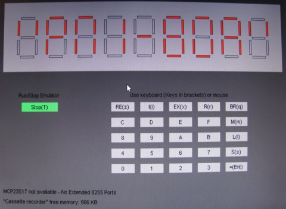

PMI 80 emulator using FabGL
===========================

The great FabGL library created by Fabrizio Di Vittorio delivers above all graphics library for ESP32 in conjunction with a VGA monitor. In addition to its own library, on the basis of which you can build your own project, it also contains a number of examples for library usage. Among them are emulators of old 8-bit computers from the era about 40 years ago. E.g. here you will find computers Altair 8800, Commodore VIC-20 and even a 16-bit IBM XT computer with a number of optional operating systems.

About 40 years ago, a single-board PMI 80 computer appeared in Czechoslovakia, which was primarily used for teaching work with the first microprocessors. You can find information about it, for example at https://sk.wikipedia.org/wiki/PMI-80. Performance of the FabGL library makes it relatively easy to create an emulator of such a computer on a VGA screen.

PMI80 emulator requirements
---------------------------

*   On the HW side, the ESP32 WROVER module must be connected according to the diagram on the website http://www.fabglib.org . It is necessary to connect a VGA monitor, a PS2 keyboard to the module and possibly a PS2 mouse. If the MCP23S17 expander circuit is also available, expanding PIO 8255 is partially emulated also.
*   Install the Arduino IDE (tested with version 1.8.13 up to 1.8.19) with ESP32 support. The Arduino IDE must be supplemented with the FabGL library.
*   Place the folder that contains the two files PMI80A.ino and pmi80rom.h in the folder, where Arduino saves projects on your computer.
*   After opening the project, you should be able to load the program into the ESP32 memory (instructions are on the website). The settings are the same as for the other computers in the examples FabGL shown in video tutorials.
*   A microSD card is not required for the function.

The principle of the emulator program
-------------------------------------

The program mainly uses FabGL library classes for work. Graphical interface of the application is made up of several uiFrames in which the user communicates through uiColorBox (forms segments of the display) and uiButton buttons. The actual emulation of the 8080 processor is done by an instance of the i8080 class.

The second library used in the program is SPIFFS. It is used to create "cassette recorder". Programs that would be stored on tape are within SPIFFS stored in ESP32 memory as pmi\_xx.bin files, where "xx" specifies the number entered in the "S" command of the PMI80 monitor.

Using an emulator
-----------------

The program can be controlled via a connected PS2 keyboard or with a mouse by clicking individual buttons on the screen. The Start/Stop (T) button starts and stops the processor from running. Stored data (files on "cassette tape") they remain in the ESP32 memory until you overwrite them. Instructions for use of the microcomputer it is necessary to search on the web. The minor differences in computer ROM are in storage data "on cassette" and in the computer designation as PMI-80A.

Conclusion
----------

In the FabGL library users gained a powerful tool for creating not only their own projects, but in the examples of emulated computers also a lot of older software created for completely different devices many years ago.

References
----------

http://www.fabglib.org  
https://github.com/fdivitto/FabGL  

* * *

Emulátor PMI 80 pomocí FabGL
============================

Skvělá FabGL knihovna, kterou vytvořil Fabrizio Di Vittorio, přináší především grafickou knihovnu pro ESP32 ve spojení s VGA monitorem. Kromě vlastní knihovny, na jejímž základě můžete postavit vlastní projekt, obsahuje i řadu příkladů pro použití knihovny. Mezi nimi jsou i emulátory starých 8bitových počítačů z doby před asi 40 lety. Např. zde najdete počítače Altair 8800, Commodore VIC-20 a dokonce i 16bitový počítač IBM XT s řadou volitelných operačních systémů.

Před asi 40 lety se v Československu objevil jednodeskový počítač PMI 80, který sloužil primárně pro výuku práce s prvními mikroprocesory. Informace o něm najdete např. na https://sk.wikipedia.org/wiki/PMI-80 . Výkon knihovny FabGL umožňuje poměrně snadno vytvořit emulátor takového počítače na VGA obrazovce.

Požadavky pro emulátor PMI80
----------------------------

*   Po HW stránce musí být modul ESP32 WROVER zapojený podle schéma na stránkách http://www.fabglib.org . K modulu je potřeba připojit VGA monitor, PS2 klávesnici a případně i PS2 myš. Pokud je k dispozici i obvod expanderu MCP23S17 emuluje se částečně i rozšiřující PIO 8255.
*   Na osobním počítači musí být instalováno Arduino IDE (testováno s verzí 1.8.13 až 1.8.19) s podporou ESP32. Arduino IDE se doplní o knihovnu FabGL.
*   Složku, která obsahuje dva soubory PMI80A.ino a pmi80rom.h umístěte do složky, kam Arduino ukládá na vašem počítači projekty.
*   Po otevření projektu byste měli být schopni nahrát program do paměti ESP32 (návody jsou na webu). Nastavení je stejné jako u dalších počítačů v příkladech FabGL ukázaných ve video návodech.
*   Pro funkci není potřeba mikroSD karta.

Princip programu emulátoru
--------------------------

Program využívá pro práci především třídy knihovny FabGL. Grafické rozhraní aplikace je tvořeno několika rámci uiFrame, v nichž uživatel komunikuje prostřednictvím uiColorBox (tvoří segmenty displeje) a tlačítek uiButton. Vlastní emulaci procesoru 8080 provádí instance třídy i8080.

Druhou knihovnou použitou v programu je SPIFFS. Ta slouží k vytvoření "kazetového magnetofonu". Programy, které by se ukládaly na kazetu, jsou v rámci SPIFFS ukládány do paměti ESP32 jako soubory pmi\_xx.bin, kde "xx" určuje číslo zadávané v příkazu "S" monitoru PMI80.

Použití emulátoru
-----------------

Program je možné ovládat přes připojenou klávesnici PS2 nebo pomocí myši klikáním na jednotlivá tlačítka na obrazovce. Tlačítko Start/Stop (T) spouští a zastavuje běh procesoru. Uložená data (soubory na "pásce kazetového magnetofonu") zůstávají v paměti ESP32 do doby, než je přepíšete. Návod k použití mikropočítače je nutné hledat na webu. Drobné odlišnosti v ROM paměti počítače jsou v ukládání dat "na kazetu" a v označení počítače jako PMI-80A.

Závěr
-----

V knihovně FabGL získali její uživatelé mocný nástroj na tvorbu nejen vlastních projektů, ale jak ukazují příklady emulovaných počítačů i na využití staršího software vytvořeného pro úplně jiná zařízení před mnoha lety.

Použitá literatura
------------------

http://www.fabglib.org  
https://github.com/fdivitto/FabGL